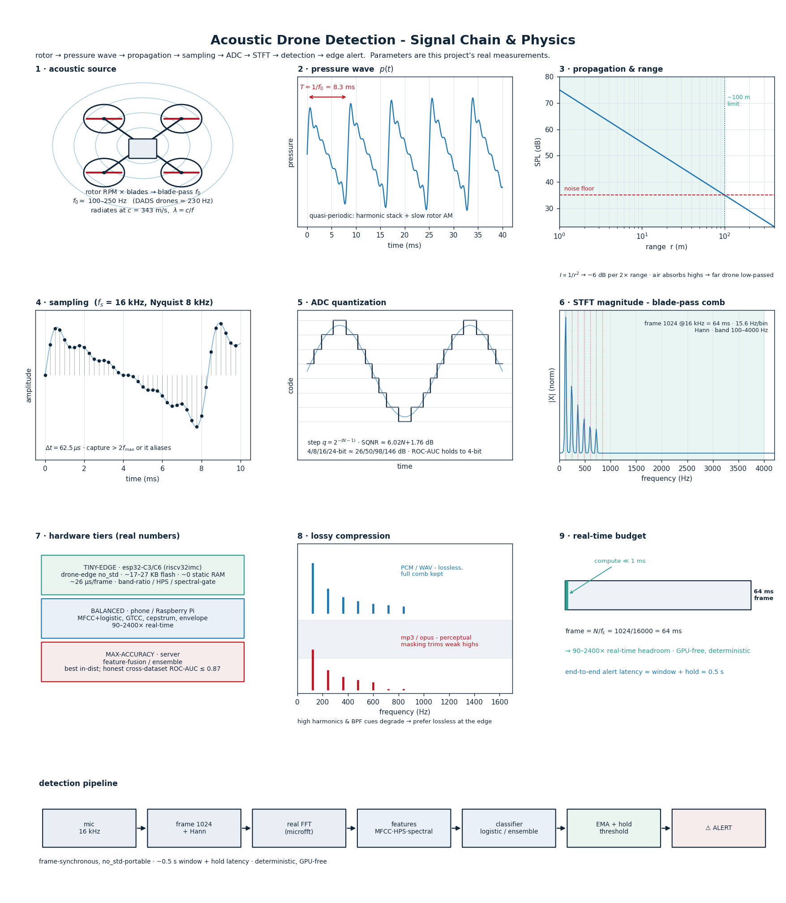
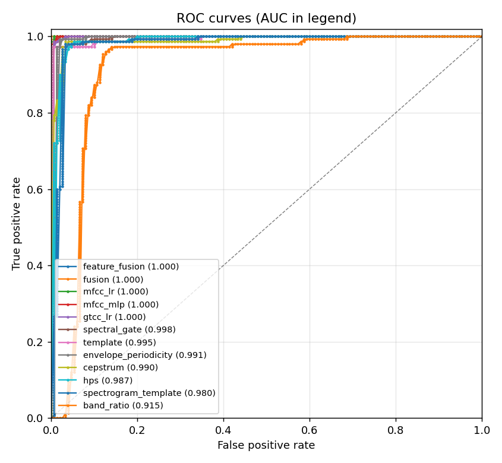
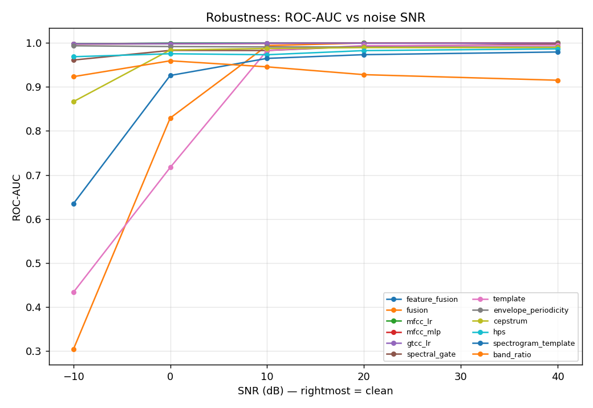
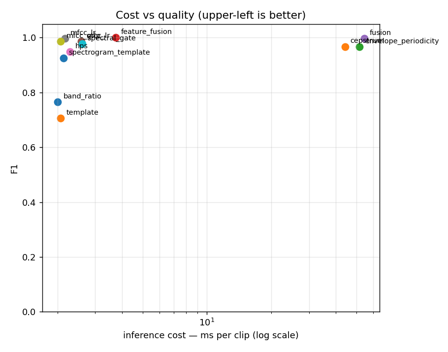
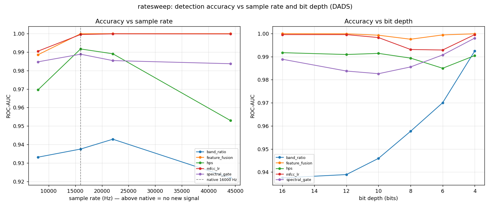

# Acoustic-Drone-Detection

Detecting drones accoustically.



<sub>The full signal chain, with this project's real parameters: rotor acoustics → pressure wave → sampling (Nyquist) → ADC quantization → STFT blade-pass comb → detection pipeline → hardware tiers. Regenerate with `docker compose run --rm --entrypoint python plot scripts/infographic.py` ([`scripts/infographic.py`](scripts/infographic.py)).</sub>

**State of project:** We can detect drones qualitatively. We benchmarked the performance of different algorithms and models for detection on different hardwares, and bundle everything into an extensible rust crate toolbox, that can be controlled via CLI and also be lowered to esp32-s3 or other edge hardware. Approaches for detecting drone situational attributes (`distance`, `elevation`, `speed`) and hardware attributes (`type`, `vendor`, `rotor_count`, `drone_health`, `drone_weight`) are wired in and ready to be perf-optimized and extended.

**Notable mention** worth checking out: [batear-io/batear](https://github.com/batear-io/batear) for simple drone detection on esp32-S3+mic.

## TOC

1. [Scope](#1-scope)
2. [On Audio and Sound](#2-on-audio-and-sound-human-reasoning) (human reasoning)
3. [Possible Approaches](#3-possible-approaches-human-reasoning) (human reasoning)
4. [Constraints of v0.1.0](#4-constraints-of-this-projects-first-iteration-v010) (human reasoning)
5. [Implementation](#5-implementation-v010) (ai summary)
6. [Contributing](#6-contributing)
7. [License](#7-license)

## 1. Scope

Design an acoustic drone detection pipeline, and validate your ideas in simulation.

Questions we answer with this porject:

- Detection. What makes a drone signature distinguishable from background sound? What features or representations would you feed a model, and how would you know it's actually working?
- Direction of Arrival. If you used multiple microphones, how would you estimate where the drone is? What does array geometry buy you, and what are the trade-offs?
- Robustness. Real deployments are noisy - literally. Wind, rain, overlapping sources, varying drone types. How would you stress-test your approach? This is where simulation earns its keep: you control what you throw at it.
- System Design. What would a real deployment look like? How many microphones, in what configuration, at what sample rate? What detection range would you expect and why? What are the fundamental physical limits?

## 2. On Audio and Sound (Human reasoning)

**Sound** is the pressure of a material (mostly air) fluctuating over time. Sound has a speed of `355 m/s` m air at 40 degrees celsius and a speed of `343m/s` in air at 20 degrees celsius. So environmental conditions are relevant to detection.

**Microphones** exist in different types, based on different physical quantities that changes with pressure:
  + magnetic microphones measure the vibration of air by it moving the microphone head up and down, they are omnidirectional
  + laser microphones measure the vibration (pressure) of an object that the laser points at, interferometrically, they are unidirectional
  + other types of microphone exist, for example gyroscopes of phones can sample audio at a low amount. also smart materials like piezzo-crystals can be used to turn pressure on a surface to electrical impulses

**Sample frequency** is how many times per second microphones measure this pressure in one point.
  + old phones like a nokia have around 8k measurements per second
  + common sampling rate is `44.1kHZ` which most microphones and hardwares can do today
  + there exist better sampling rates for studio or specialised hardware equipment

**Audio** is how the sound is stored by digital devices:
  + an ADC (Analog-Digital-Converter) converts electrical pulses from a microphone to a binary signal / value
  + the qualitative resolution off this conversion depends on the adc, older ones got `8 bit`, newer ones `24 bit`, `32 bit` or even better quality
  + audio is usually stored compressedly, as storing it as a raw `.wav` file / pickled numpy array takes too much storage.
  + audio compression is lossy, as humans dont need to head all the spectrum to detect voice for example. different audio codecs exist, for example implemented in the `ffmpeg project` (c++). modern codecs include `.mp3`, `.m4a`, `.opus` (whatsapp). it is important to consider these differences for data quality also, as a lossy codec might ruin predictions of more precise properties of a drone or situation.

## 3. Possible Approaches (Human reasoning)

- Detection:
  + Audio is sampled at a rate `f`, keep in mind [Nyquist–Shannon sampling theorem](https://en.wikipedia.org/wiki/Nyquist%E2%80%93Shannon_sampling_theorem) -> fft / short time fourrier transform -> frequencies histogram which should be characteristic (like for guitars / pianos / fridges) ; drone audio may also be assumed sort of periodic
  + Drone Audio Dataset -> kaggle, gh, huggingfacce (saraalemadi/DroneAudioDataset, GitHub https://share.google/3r4LoZTEbmyATlB56 ; Audio | Drone Sound Detection https://share.google/rMNhLehvEraoAqpfG)
  + Multi-Dataset found on Kaggle that combines multiple drone datasets
  + Broader audio classifier by Google YAMNet (Open-Source)
  + Drone params possibly estimatable (some of which correlated): `drone.type`, `drone.rotor_size`, `drone.distance`, `drone.height`, `drone.speed`,`drone.accelleration`, `drone.type`, `drone.rotor_damage`, `drone.direction`, `drone.elevation_angle`, `drone.motor_health`, `drone.obstacles_inbetween`
- Direction of Arrival
  + Multiple Microphones, at best high sample rate and some distance between them 
  + Triangulation possible
  + Audio Interferometry / Interference of the audio signal
- Robustness
  + ask people from own network who detect unique events in noisy real time data, possibly https://hydrop-systems.com/ or https://kinemic.com/de/
  + detect other events and do software based "noise canceling" in the data, as most noise is cancelable if periodic or just plain white noise or so "rausrrechnen"
  + possibly have a directional mic / laser mic that is more precise and unidirectional and based on the "noisy" mics the rough direction could be estimated
  + speed of sound may vary a bit depending on conditions
- System Design
  + important params are: environmental noise in deployment, other counter-engineering in-field ; as well as the specific dimensions of the hardware, and limitations like `microphone_count`, `microphone_count`, `sample_freq`, `microphone_positions` relative to each other, ...
  + enclosure for durability needed against weather, depending on where its used also against emp, laser or similar
  + edge hardware / is it an `avr8` or `xtensa` esp32 or something like an intel edge ai thing?
  + for maxium performance of audio processing, a fpga or asic chip might be needed to handle the full bit-width and high sample rates at once (we got one at home to test possibly later, has 45k look up tables)

## 4. Constraints of this projects first iteration (v0.1.0)

- Only one real drone for testing
- Limited hardware: esp32 s3, c6, p4 modules, and a ffew arduino boards notably the Q 4gb ram one
- Hardly any specialised microphones here in our appartment (only one camera attached, rest phone and laptop ones)
- Limited AI Budget of 50€ (claude weekly limit)
- Limited dev time, only one afternoon time for v0.1.0

## 5. Implementation (v0.1.0)

Built in Rust for fast, typed iteration on real DSP - and so the core can later
be lowered onto edge hardware (esp32 xtensa / riscv). It's structured as a
multi-task suite (insightface-style: one shared DSP backbone + a common eval
harness + many task "heads"). Crates live under `crates/` (no workspace yet, by
design):

- **`drone-dsp`** - `no_std` DSP backbone reused by every head: Hann windowing,
  real FFT (`microfft`), magnitude spectrum, spectral features. Math via `libm`,
  so it builds bare-metal.
- **`drone-detect`** - `no_std` heuristic detector (energy-in-band + dominant
  tone). The transparent baseline.
- **`drone-cli`** - host binary `drone`: `synth` a test signal, `analyze` WAVs.
- **`drone-bench`** - shared eval harness: pluggable `Approach` trait, dataset
  loader (CSV/synth, stratified split, k-fold, SNR augmentation), metrics
  (F1, calibrated-F1, ROC-AUC, PR-AUC, Brier, real-time factor), JSON output.
  Hosts **12** detection approaches.
- **`drone-doa`** - direction-of-arrival: GCC-PHAT TDOA + ULA geometry → azimuth,
  with a propagation simulator and an angular-error benchmark (`no_std` core).
- **`drone-id`** - multiclass drone-**type** recognition (MFCC + multinomial
  logistic) with per-class F1 + confusion matrix.
- **`drone-freq`** - blade-pass-frequency / RPM estimation (HPS + cepstrum +
  autocorrelation fusion) - an inferrable drone property.

### Capabilities at a glance (real-data results)

| task | crate | headline result | notes |
|---|---|---|---|
| **Detection** (drone vs not) | `drone-bench` | best **F1 1.000 / ROC-AUC 1.000** (`feature_fusion`); 8/12 beat CNN baselines | all run 90–2400× real-time |
| **Direction of arrival** | `drone-doa` | **RMSE 0.88°** @20 dB (±60°), 2.8° @10 dB | 4-mic ULA, simulated |
| **Type ID** (bebop/membo/unknown) | `drone-id` | **macro-F1 0.86** on Al-Emadi multiclass | linear softmax; honest |
| **Blade-pass freq / RPM** | `drone-freq` | synth **f0 MAE ~1 Hz, 0% octave error** | real DADS drones cluster ~230 Hz |
| **Robustness** | `drone-bench --snr` | learned methods hold ROC-AUC >0.95 to **−10 dB**; naive baselines collapse | see `benchmarks/plots/robustness_*.png` |

### Detection approaches & benchmark

Twelve approaches are implemented and benchmarked head-to-head (each emits a
confidence in `[0,1]`, so they're comparable via ROC/PR). On a real
[DADS](https://huggingface.co/datasets/geronimobasso/drone-audio-detection-samples)
subset (300 + 300 clips, 50/50 split); `F1*` = best-threshold (calibrated) F1,
`×RT` = times faster than real time:

| approach | F1 | F1* | ROC-AUC | ×RT |
|---|---|---|---|---|
| `feature_fusion` - fused MFCC+spectral+harmonic+cepstral + logistic | **1.000** | 1.000 | 1.000 | 1300× |
| `mfcc_lr` - MFCC + logistic regression | 0.997 | 0.997 | 1.000 | 2300× |
| `fusion` - logistic stack (ensemble) over the classics | 0.997 | 1.000 | 1.000 | 90× |
| `mfcc_mlp` - MFCC + small MLP | 0.987 | 0.993 | 1.000 | 2400× |
| `gtcc_lr` - gammatone cepstral coeffs + logistic | 0.987 | 0.990 | 1.000 | 1900× |
| `spectral_gate` - flatness/entropy/band-ratio + logistic | 0.977 | 0.986 | 0.998 | 1900× |
| `cepstrum` - cepstral / autocorrelation periodicity | 0.967 | 0.977 | 0.990 | 110× |
| `envelope_periodicity` - AM modulation spectrum | 0.966 | 0.987 | 0.991 | 95× |
| `hps` - harmonic-product-spectrum / comb | 0.949 | 0.967 | 0.987 | 2150× |
| `spectrogram_template` - 2D spectro-temporal template | 0.925 | 0.974 | 0.980 | 2300× |
| `band_ratio` - baseline heuristic | 0.766 | 0.921 | 0.915 | 2450× |
| `template` - cosine vs. averaged drone spectrum | 0.706 | 0.986 | 0.995 | 2370× |

Cheap classical/light methods score very high here - no GPU, all real-time on a
desktop. **⚠ Honesty caveat:** these are *in-distribution* numbers on a random
clip-level split of one dataset (DADS), which very likely has recording-level
**leakage** (short clips from shared source recordings landing in both train and
test), so they are optimistic and **not** an apples-to-apples win over published
CNN baselines. The trustworthy tests - **cross-dataset** and **hard-negative**
(aircraft / car / wind) evaluation - are the current priority; see
[`agent-memory/notes/honest-limitations.md`](agent-memory/notes/honest-limitations.md).
Plots (ROC, PR, cost-vs-quality, robustness) live in
[`benchmarks/plots/`](benchmarks/); methodology in
[`benchmarks/README.md`](benchmarks/README.md).

### Benchmark plots

<table>
<tr>
<td width="50%"><br><sub><b>ROC</b> &middot; in-distribution, all 12 approaches (labelled with ROC-AUC)</sub></td>
<td width="50%"><br><sub><b>Robustness</b> &middot; ROC-AUC vs SNR; learned methods hold above 0.95 to -10 dB</sub></td>
</tr>
<tr>
<td width="50%"><br><sub><b>Cost vs quality</b> &middot; inference ms/clip (log x) vs F1</sub></td>
<td width="50%"><br><sub><b>Rate / bit-depth</b> &middot; detection flat from 8 kHz up, robust to 4-bit</sub></td>
</tr>
</table>

Regenerate any of these with `docker compose run --rm plot` (see
[`benchmarks/README.md`](benchmarks/README.md)); the physics + signal-chain
poster above is `scripts/infographic.py`.

### Quick start (Docker-first)

```bash
# Generate a synthetic drone signal and analyze it (writes into ./data)
docker compose run --rm detector synth   --out /data/test.wav --fundamental 120
docker compose run --rm detector analyze --input /data/test.wav

# Fetch a real dataset subset, benchmark all 12 detectors, and plot
docker compose run --rm data --per-class 300
docker compose run --rm bench --data /work/data/dads      # add --kfold 5 or --snr 0
docker compose run --rm plot

# Other task heads (run inside the dev toolchain container)
docker compose run --rm --entrypoint bash dev -c \
  "cargo run -r --manifest-path crates/drone-doa/Cargo.toml --bin doa-bench"   # direction of arrival
docker compose run --rm --entrypoint bash dev -c \
  "cargo run -r --manifest-path crates/drone-id/Cargo.toml -- --synth"          # drone-type ID
docker compose run --rm --entrypoint bash dev -c \
  "cargo run -r --manifest-path crates/drone-freq/Cargo.toml -- --data /work/data/dads"  # blade-pass freq

# Run the full check suite: folderinfo lint, fmt, clippy -D warnings, tests, no_std builds
docker compose run --rm dev
```

> On Git Bash (Windows) prefix docker commands with `MSYS_NO_PATHCONV=1`, or use
> PowerShell - otherwise `/data/...` args get rewritten. See `CLAUDE.md`.

Agent working memory - decisions, insights, domain notes, and session handoffs -
is tracked in [`agent-memory/`](agent-memory/MEMORY.md).

## 6. Contributing

Welcome! fork -> branch `[name]/feat|fix-[feat/fix-name]` -> pr -> fix feedback -> get merged

## 7. License

Use in the open only.

> what is the license that makes people need to open source if they modify or use it?

Google says AGPLv3.

let license = "AGPLv3";

```
ACOUSTIC-DRONE-DETECTION

Copyright (C) 2026 Julia Yukovich

This project is licensed under the GNU Affero General Public License v3.0.
See the LICENSE file for details.
```